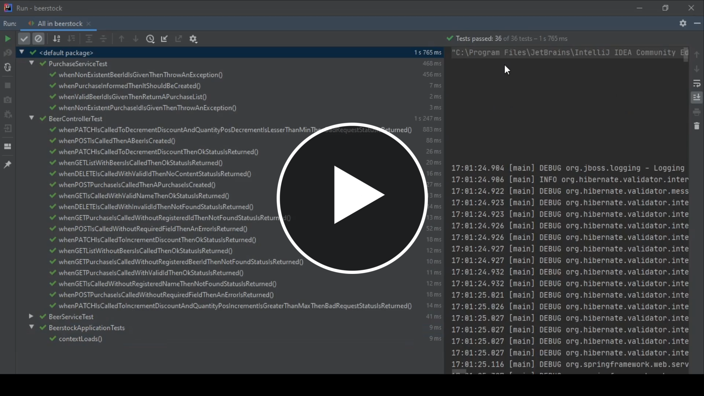

# Desafio-Spring-Dio-TQI-Bootcamp
Desafio de Projeto cuja proposta é o desenvolvimento de uma API Rest em Spring Boot/Spring Framework de Gerenciamento de Estoque de Cervejas. O desafio de projeto foi ministrado por [Peleias](https://github.com/rpeleias-v1) no Bootcamp TQI Fullstack Developer da TQI na Dio.

Além das rotas implementadas junto ao professor, eu também adicionei as rotas de compras junto a seus devidos testes. As compras possuem o id de um cliente, o id da cerveja e a quantidade comprada daquela cerveja, além do seu id. As rotas do #CRUD de compras são:
- **POST /purchase/ -**
É responsável pelo registro de compra.
- **GET /purchase/:id -**
Retorna uma compra pelo id.
- **GET /purchase/ofBeer/:id -**
Retorna uma compra pelo id da cerveja associada.

Sintam-se livres para dar feedback e/ou contribuir.

  

